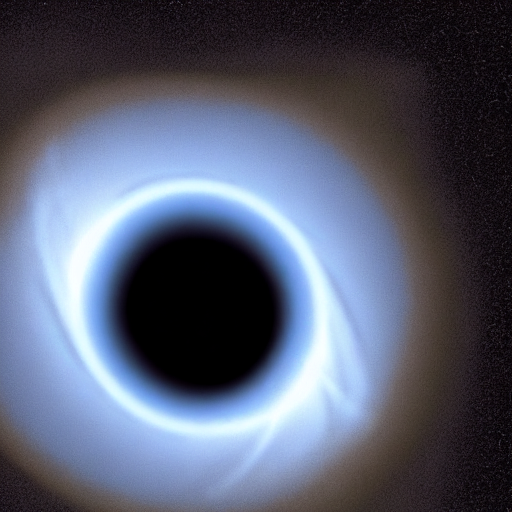
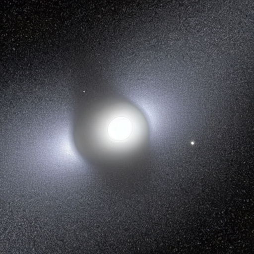
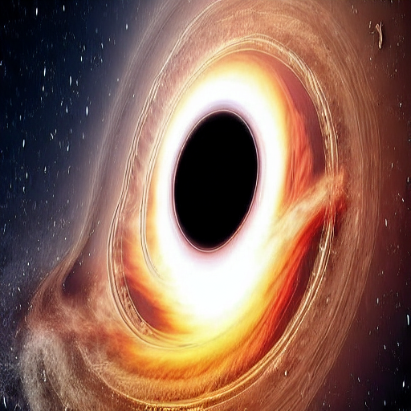

# Astro-Diffusion

**Astro-Diffusion** is a text-to-image generator specifically fine-tuned on astronomy data.

🔗 **[Live Demo](hyperlink-of-the-front-end-live)** | 📹 **[Video Tutorial](hyperlink-of-the-video-demo)**

> ⚠️ Please use sparingly, since each generation costs GPU time and the backend enforces rate-limits. Due to my constraints, I can only support up to a modest budget in total.  
> ⏱️ This is a serverless deployment, so the backend may take ~30–60 seconds to cold-start and some requests may require a manual refresh.

The UI compares **Base SD1.5** vs **LoRA-fine-tuned model** on astronomy prompts.

---

## 📊 Dataset Sources

I am extremely grateful to these contributors for making their data available freely:
- [Images of Galaxies and Black Holes](https://www.kaggle.com/datasets/nikitavet/images-of-galaxies-and-black-holes)
- [ESA Hubble Images (3 Classes)](https://www.kaggle.com/datasets/subhamshome/esa-hubble-images-3-classes)

---

## 🚀 Overview

This repo contains a **full pipeline** for fine-tuning Stable Diffusion 1.5 on a curated dataset of astronomical images and serving it through both a web UI and a programmatic API.

The project demonstrates how to:
- Collect and clean domain-specific data
- Generate text prompts using a large multi-modal model
- Train a LoRA adapter
- Evaluate its performance
- Deploy the resulting model as a web service

A containerized version is published on the **GitHub Container Registry (GHCR)** with the `:prod` tag for easy deployment. Currently the data and my checkpoint are on my private repo on Hugging Face Hub—I'll make these public in future. But the framework here can be used with custom image-prompt datasets.

---
## 📸 Results

**Examples**

### Model Comparison

#### Prompt 1
> "A supermassive black hole, with its accretion disc and relativistic jets, at very high contrast. The event horizon is pitch black."

| Base Model | LoRA Model |
|------------|------------|
|  |  |

#### Prompt 2
> "A supermassive black hole in a tidal disruption event with a nearby large star. The relativistic jets are at a very high contrast, with immense gravitational distortion of the surrounding cosmos. The central event horizon is pitch black."

| Base Model | LoRA Model |
|------------|------------|
|  |  |

### Frontend Preview


### Workflow Diagram


---

## 📈 Metrics

| Metric | Base SD1.5 | Astro-Diffusion LoRA | Improvement |
|--------|-----------|---------------------|-------------|
| **FID** ↓ | 221.3 | 208.02 | ✅ Lower is better |
| **CLIP Score** ↑ | 0.32 | 0.40 | ✅ Higher is better |
| **LPIPS** ↓ | 0.48 | 0.39 | ✅ Lower is better |

---

## ✨ Highlights

### 🗂️ Domain-Specific Dataset
- **1,000+ images** of galaxies, nebulae, star clusters, etc., curated from open-source data
- Currently hosted on Hugging Face Hub
- De-duplicated using **CLIP embeddings** and **FAISS** to remove near-identical pictures

### 🤖 Automatic Captioning
- Prompts generated automatically with **Qwen 2 VL 7B Instruct** model at 4-bit quantization
- Script resizes each image to **512×512 px** and produces precise captions describing object class and visual details

### 🎯 LoRA Fine-Tuning
- Lightweight LoRA adapter trained on the JSONL manifest
- Training loop uses **Hugging Face Accelerate** with gradient accumulation, learning-rate warm-up, and periodic checkpointing
- LoRA ranks and hyperparameters are configurable via YAML

### 📊 Comprehensive Evaluation
- Utilities to generate before/after grids
- Compute **CLIP scores** and estimate **FID/ISC** using `torch-fidelity`
- Example evaluation scripts show how to compare base SD 1.5 against the fine-tuned model

### 🎨 Interactive UI
- Polished **Gradio interface** lets users compare base and LoRA models side-by-side with a single prompt
- Includes sliders for steps, guidance, resolution, and seed
- Integrates a rate-limiter to prevent abuse

### ⚡ FastAPI Backend
- API exposes `/infer`, `/metrics-lite`, and `/health` endpoints
- `/infer` route accepts a prompt and generation parameters, returns base and LoRA images encoded in **base64**
- Rate-limiter protects the service from denial-of-service attacks and cost overruns

### 🐳 Containerized
- Entire stack (models + UI + API) packaged as a **Docker image** published on GHCR
- Run locally or deploy on any container orchestration platform with a single command

---

## 📂 Repository Structure

| Path | Purpose |
|------|---------|
| `configs/` | YAML configuration files for training (`sft_sd15.yaml`) and inference (`infer.yaml`). `train_config.py` defines typed dataclasses and a loader for config files. |
| `src/train/` | Modular training pipeline—data loading, model components, optimization, and training loop. |
| `src/dataset.py` | Simple PyTorch Dataset that reads image-caption pairs from a JSONL manifest. |
| `src/preprocess_images.py` | Deduplicates images using CLIP + FAISS to create a `_clean` dataset. |
| `src/caption_images.py` | Uses Qwen 2 VL 7B Instruct to caption images and writes a manifest. |
| `src/train/train_loop.py` | Core training loop for LoRA fine-tuning. |
| `src/eval.py` | Evaluation utilities: load a pipeline, compute CLIP scores, and calculate FID/ISC. |
| `src/ui_gradio.py` | Gradio UI with rate-limited inference. |
| `src/api.py` | FastAPI service with `/infer`, `/metrics-lite`, and `/health` endpoints. |
| `src/generate_videos.py` | Optional script to convert generated images into short videos via Stable Video Diffusion. |
| `src/infer.py` | CLI script for single-prompt inference. |

---

## 📊 Data Collection & Preprocessing

### 1. Dataset Acquisition
Raw images are downloaded from the Hugging Face Hub (1,000+ high-resolution astronomical photographs) from the aforementioned data sources. They are organized into class-specific folders (e.g., `spiral_galaxies`, `nebulae`, `planets`).

### 2. Deduplication
To avoid training on near duplicates, `preprocess_images.py` computes **OpenCLIP embeddings** and finds similar images using **FAISS**. Only unique images are copied to a sibling `_clean` directory.

### 3. Caption Generation
`caption_images.py` employs the **Qwen 2 VL 7B Instruct** model in NF4-bit mode to produce descriptive captions. It resizes each image to 512×512 and generates a concise sentence describing object class, colors, and structures. Captions and image paths are written to a JSONL file which becomes the training manifest.

### 4. Manifest Creation
`make_manifest_from_folder.py` merges cleaned images with captions and produces `train.jsonl` / `val.jsonl` records containing `{"path", "caption"}` lines. The `JsonlImageCaptionDataset` class reads these manifests during training.

> 📝 Currently all the data is in private repos on my Hugging Face Hub account. I'll make it public in the future.

---

## 🏋️‍♀️ Training Pipeline

The fine-tuning pipeline is modular and built around the **Hugging Face Diffusers** library.

### Configuration
Hyperparameters are defined in `configs/sft_sd15.yaml`. Key parameters include batch size, learning rate, number of training steps, LoRA rank, and dropout. The `train_config.py` module parses the YAML into typed dataclasses.

### Component Loading
`train_models.load_components()` loads the base Stable Diffusion tokenizer, text encoder, VAE, UNet, and scheduler from the local snapshot. The text encoder and VAE are frozen for inference-only use. If `use_lora` is true, the UNet is wrapped with a LoRA adapter targeting the attention projection matrices.

### Data Loading
`train_data.build_dataloader()` constructs a DataLoader over the JSONL manifest with standard image transforms (resize, center-crop, normalize to –1…1).

### Optimization
The training loop uses **AdamW** with optional 8-bit optimization and a linear warm-up scheduler. Gradient accumulation and mixed precision (bf16/fp16) are supported through Accelerate.

### Training Loop
For each batch, latents are encoded by the VAE and random noise and timesteps are sampled. The UNet predicts the noise and computes an MSE loss against the true noise. Gradients are back-propagated, optimizer steps are taken, and LoRA checkpoints are saved periodically. A final `unet_lora_final` folder contains the trained adapter weights.

### Runtime
On a single **16 GB GPU**, training ~3,000 steps with batch size 4 takes around **3–4 hours**. The LoRA adapter typically saturates the dataset after ~2,500 steps, so early stopping based on validation loss is advised.

---

## 📈 Evaluation

To quantify improvements of the fine-tuned model over the base model, the repository provides a suite of evaluation tools:

### Before/After Grids
The `grid_for_prompts()` function generates a horizontal grid of images for a list of prompts. The `eval_driver.py` script produces side-by-side comparisons for a chosen set of prompts.

### CLIP Score
`eval_clip()` computes the mean and standard deviation of CLIP scores across a set of prompts. Higher scores indicate better alignment between the generated image and the prompt.

### FID & Inception Score
`fid_from_lists()` estimates the **Fréchet Inception Distance (FID)** and **Inception Score (IS)** between generated images and real images.

| Metric | Base SD1.5 | Astro-Diffusion LoRA | Improvement |
|--------|-----------|---------------------|-------------|
| **FID** ↓ | 221.3 | 208.02 | ✅ Lower is better |
| **CLIP Score** ↑ | 0.32 | 0.40 | ✅ Higher is better |
| **LPIPS** ↓ | 0.48 | 0.39 | ✅ Lower is better |


These numbers illustrate substantial improvements in both photorealism (lower FID) and prompt adherence (higher CLIP and IS). Run your own evaluations on the validation set and update the table accordingly.

---

## 🚀 Inference and Demo

### CLI Inference

To generate a single image from the fine-tuned model on the command line:

```bash
# Install dependencies
pip install -r requirements.txt

# Set up your inference config (update model_dir)
cp configs/infer.yaml my_infer.yaml

# Run inference
python src/infer.py --config my_infer.yaml --prompt "a crimson emission nebula with dark dust lanes"
```

The script loads the model from the specified `model_dir` and saves the output PNG.

### Gradio UI

The Gradio interface offers an interactive way to compare the base SD 1.5 model with the custom LoRA. Launch it locally with:

```bash
python src/ui_gradio.py --config configs/infer.yaml --lora-hf-id <your_hf_repo> --lora-subdir unet_lora_final
```

When running inside the Docker container (see below), the UI is automatically served on **port 7861** and can be accessed at `http://localhost:7861/` or the public link displayed by Gradio. You can adjust the prompt, number of steps, guidance scale, image resolution, and seed; the base and LoRA outputs are displayed side-by-side.

> ⚠️ **Use the UI sparingly.** To prevent abuse, a rate limiter restricts the number of requests per session and per IP. If you exceed the quota, the API will respond with a `429` error indicating when you may retry. The free GPU powering this demo is not suited for batch generation; for heavy use, run the container on your own hardware.

### FastAPI Service

For programmatic access, run the API server:

```bash
python src/api.py  # uses configs/infer.yaml by default
```

The API exposes three routes:

- **`POST /infer`** – accepts JSON with fields `prompt`, `steps`, `scale`, `height`, `width`, `seed` and returns base64-encoded `base_image`, `lora_image`, generation status, and duration.
- **`GET /metrics-lite`** – returns counters such as total requests, total inference calls, and active sessions.
- **`GET /health`** – simple health check returning `{ "status": "ok" }`.

The same rate-limiter used by the UI applies here. Environment variables (see `ratelimits.py`) allow you to configure per-IP, per-session, and global request limits.

---

## 🐳 Containerization & Deployment

A production-ready container image is published to the **GitHub Container Registry** as `ghcr.io/<your-username>/astro-diffusion:prod`. It includes the API and UI, pre-configured models, and rate limiting.

To run locally:

```bash
# Pull the stable image
docker pull ghcr.io/<your-username>/astro-diffusion:prod

# Run the container
docker run --gpus all -it \
  -e HF_TOKEN=<your_hf_token> \
  -p 7861:7861 -p 8080:8080 \
  ghcr.io/<your-username>/astro-diffusion:prod
```

- The **Gradio UI** will be available on `http://localhost:7861/`
- The **FastAPI health endpoint** will respond on port `8080` (`/ping`)
- Set `HF_TOKEN` if your LoRA weights are stored in a private Hugging Face repository

You can deploy the same container on cloud services such as **AWS ECS**, **Google Cloud Run**, or **Kubernetes**. For scalable deployments, consider adding a GPU autoscaler and a front-end proxy to distribute requests across multiple replicas.

---

## 🧭 Future Work

- **Data expansion:** Incorporate additional astronomical datasets (e.g., planetary imaging, radio astronomy) and experiment with higher resolution training.
- **Model variants:** Fine-tune SDXL and test LoRA merges with open-source checkpoints specialized for space art.
- **Video fine-tuning:** Currently the `generate_videos.py` script uses the default Stable Video Diffusion model. Fine-tuning on astronomy videos could produce smoother, domain-specific animations.
- **Research metrics:** Compute and report full FID and IS on the validation set and integrate these into the CI pipeline.

---

## 📄 License

This project is released under the **Apache 2.0 license**. See [LICENSE](LICENSE) for details.
